# 📚 SLiMS Bulian 9.6 - Modul Rekomendasi Buku & Statistik Peminjaman

## ✅ 1. Langkah Instalasi SLiMS Bulian 9.6

### Persyaratan Sistem

- **Web Server:** Apache/Nginx
- **PHP:** 7.2 atau lebih tinggi
- **Database:** MySQL/MariaDB
- **Tambahan:** Composer (opsional)
- **Tools Lokal:** Laragon/XAMPP

### Langkah Instalasi

1. **Unduh SLiMS:** [GitHub SLiMS Bulian](https://github.com/slims/slims9_bulian)
2. **Ekstrak ke Folder Server Lokal:** Contoh `C:/laragon/www/slims`
3. **Buat Database Baru:** Misalnya `slims_db`
4. **Akses di Browser:** `http://localhost/slims/install`
5. **Ikuti Proses Instalasi:**
   - Isi konfigurasi database
   - Pastikan folder `files/`, `images/`, dan `repository/` bisa ditulis (`chmod 777` di Linux)
6. **SLiMS Siap Digunakan:** Akses di `http://localhost/slims`

### 🪟 Panduan Instalasi untuk Windows

#### A. Menggunakan Laragon (Direkomendasikan)

1. **Download Laragon:** [https://laragon.org/download/](https://laragon.org/download/)
2. **Install Laragon** dengan pilihan default
3. **Start Laragon** dan pastikan Apache & MySQL berjalan
4. **Copy folder SLiMS** ke `C:\laragon\www\slims`
5. **Buat database baru:**
   - Buka phpMyAdmin: `http://localhost/phpmyadmin`
   - Buat database baru dengan nama `slims_db`
6. **Akses instalasi:** `http://localhost/slims/install`
7. **Konfigurasi database:**
   - Host: `localhost`
   - Username: `root`
   - Password: (kosong, default Laragon)
   - Database: `slims_db`

#### B. Menggunakan XAMPP

1. **Download XAMPP:** [https://www.apachefriends.org/download.html](https://www.apachefriends.org/download.html)
2. **Install XAMPP** dengan pilihan default
3. **Start Apache & MySQL** dari Control Panel XAMPP
4. **Copy folder SLiMS** ke `C:\xampp\htdocs\slims`
5. **Buat database baru:**
   - Buka phpMyAdmin: `http://localhost/phpmyadmin`
   - Buat database baru dengan nama `slims_db`
6. **Akses instalasi:** `http://localhost/slims/install`
7. **Konfigurasi database:**
   - Host: `localhost`
   - Username: `root`
   - Password: (kosong, default XAMPP)
   - Database: `slims_db`

#### C. Menggunakan WAMP

1. **Download WAMP:** [https://www.wampserver.com/en/](https://www.wampserver.com/en/)
2. **Install WAMP** dengan pilihan default
3. **Start WAMP** dan pastikan icon berwarna hijau
4. **Copy folder SLiMS** ke `C:\wamp64\www\slims`
5. **Buat database baru:**
   - Buka phpMyAdmin: `http://localhost/phpmyadmin`
   - Buat database baru dengan nama `slims_db`
6. **Akses instalasi:** `http://localhost/slims/install`
7. **Konfigurasi database:**
   - Host: `localhost`
   - Username: `root`
   - Password: (kosong, default WAMP)
   - Database: `slims_db`

#### D. Troubleshooting Windows

**Masalah Permission:**

- Pastikan folder `files/`, `images/`, dan `repository/` memiliki permission write
- Klik kanan folder → Properties → Security → Edit → Add → Everyone → Full Control

**Masalah Port:**

- Jika port 80/443 terpakai, ganti port di konfigurasi web server
- Laragon: Klik kanan → Apache → httpd.conf → cari `Listen 80` → ganti ke port lain

**Masalah Database:**

- Pastikan MySQL service berjalan
- Cek koneksi database di phpMyAdmin
- Restart web server jika diperlukan

---

## 🎨 2. Perubahan Tema & File yang Dimodifikasi

### A. Tema yang Dimodifikasi

- **Lokasi Tema:** `template/default/`
- **File yang Diubah:**
  - `index_template.inc.php`: Struktur layout halaman beranda
  - `detail_template.php`: Template halaman detail buku
  - `assets/`: Folder untuk CSS, JS, dan gambar tema

### B. File Tambahan untuk Fitur

- `admin/modules/rating_buku/save_rating.php`: Menyimpan rating dari member
- `admin/modules/statistik/statistik_bulanan.php`: Menampilkan statistik peminjaman bulanan

### C. Halaman Detail Buku

- Menambahkan form rating di `template/default/detail_template.php`
- Validasi member login sebelum memberikan rating
- AJAX untuk kirim data rating tanpa reload

---

## ⭐ 3. Deskripsi Modul Rekomendasi Buku

### Nama Modul

**Modul Rekomendasi Buku berdasarkan Rating Tertinggi**

### Tujuan

Memberikan rekomendasi 5 buku terbaik berdasarkan rating tertinggi dari member/pembaca.

### Fungsi

- Mengambil data dari tabel `biblio_rating`
- Menghitung rata-rata rating (`AVG`)
- Menampilkan 5 buku dengan rating tertinggi

### File yang Digunakan

- Struktur tabel `biblio_rating`
- `admin/modules/rating_buku/save_rating.php`
- `template/default/index_template.inc.php` (untuk menampilkan rekomendasi)

---

## 📊 4. Ekspor Laporan & Statistik

### A. Ekspor Peminjaman ke Excel & PDF

- **Lokasi File:** `admin/modules/reporting/` (modul laporan bawaan SLiMS)
- **Fitur:**
  - Input tanggal mulai dan akhir
  - Ekspor ke format `.xls` dan `.pdf`
- **Teknologi:**
  - `.xls`: Header `application/vnd.ms-excel`
  - `.pdf`: Menggunakan library `FPDF`

### B. Statistik Bulanan

- **File:** `admin/modules/statistik/statistik_bulanan.php`
- Menampilkan statistik dalam bentuk dashboard admin
- Data yang ditampilkan:
  - Jumlah buku dipinjam (per bulan)
  - Jumlah buku dikembalikan
  - Jumlah keterlambatan

---

## 🖼 5. Screenshot Tampilan Akhir (yang Disarankan)

1. Halaman Beranda (berisi 5 buku terbaik)
   
   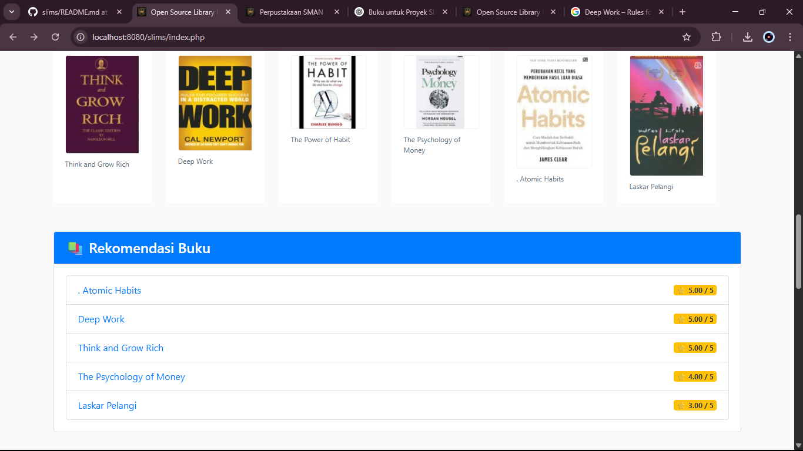
2. Halaman Detail Buku
   
   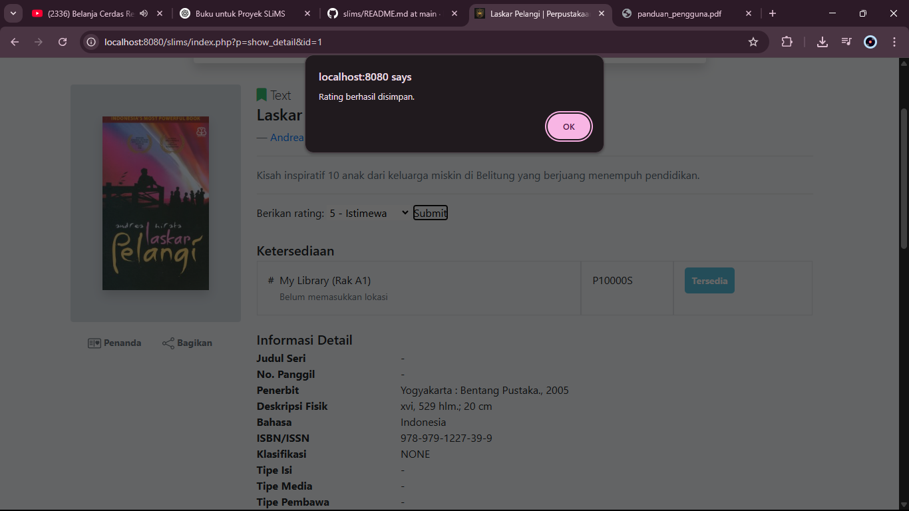
   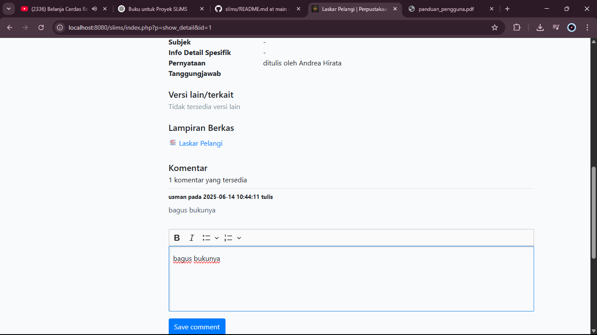
3. Halaman Panduan Pengguna
   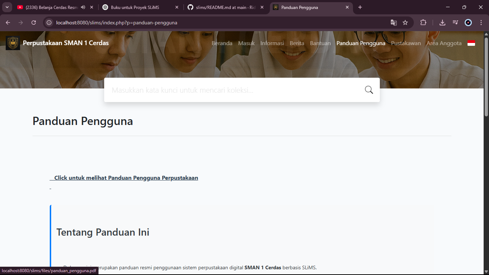
   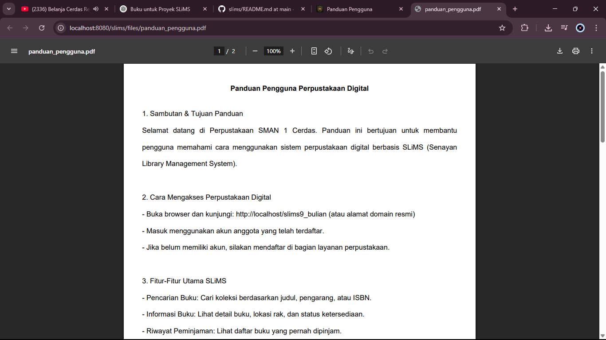
4. Halaman Beranda Admin & Statistik peminjaman bulanan
   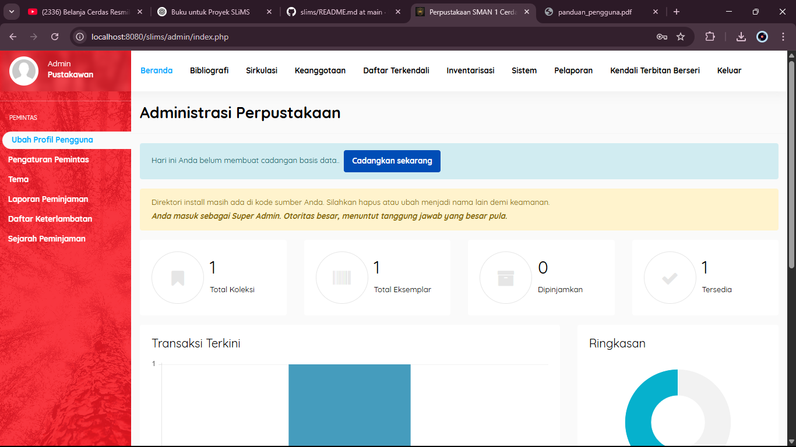
   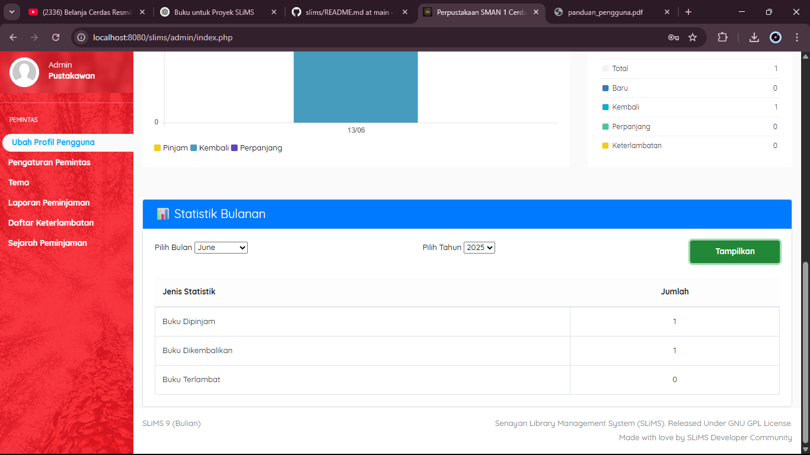
5. Hasil file Excel dan PDF dari ekspor
   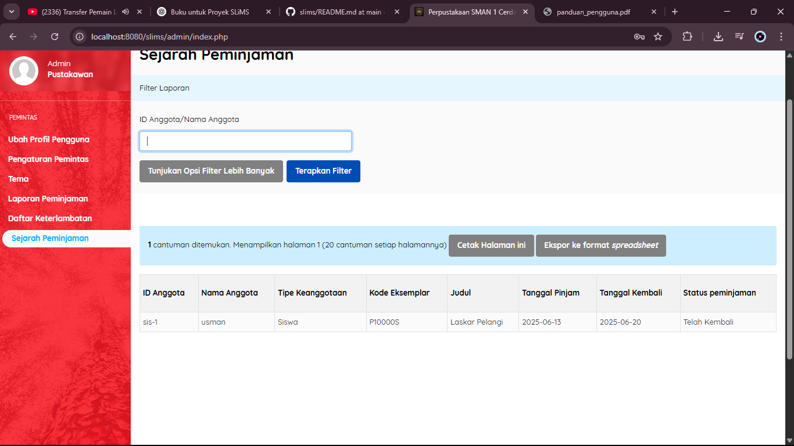
   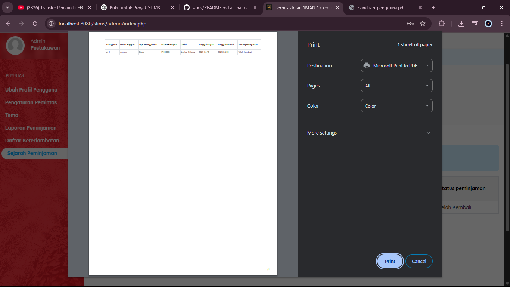
   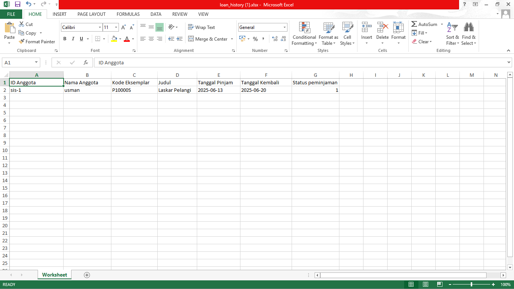
6. Halaman Informasi
   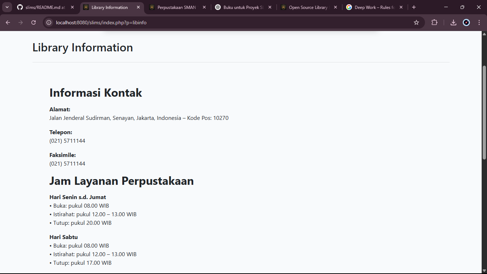
   

---

## 📂 Struktur Tabel `biblio_rating`

```sql
CREATE TABLE `biblio_rating` (
  `id` int NOT NULL AUTO_INCREMENT,
  `biblio_id` int NOT NULL,
  `member_id` int NOT NULL,
  `rating` int DEFAULT NULL,
  `created_at` datetime DEFAULT CURRENT_TIMESTAMP,
  PRIMARY KEY (`id`)
);
```

---

## 🚀 Pengembangan Selanjutnya

- Rating dengan tampilan bintang interaktif (misal menggunakan plugin jQuery Star Rating)
- Statistik grafik menggunakan Chart.js
- Modul rekomendasi berdasarkan genre atau histori peminjaman

---

_Developed by: [MUHAMMAD RIDHO ARACHMAN (14022200148) / UNIVERSITAS BINA BANGSA]_
